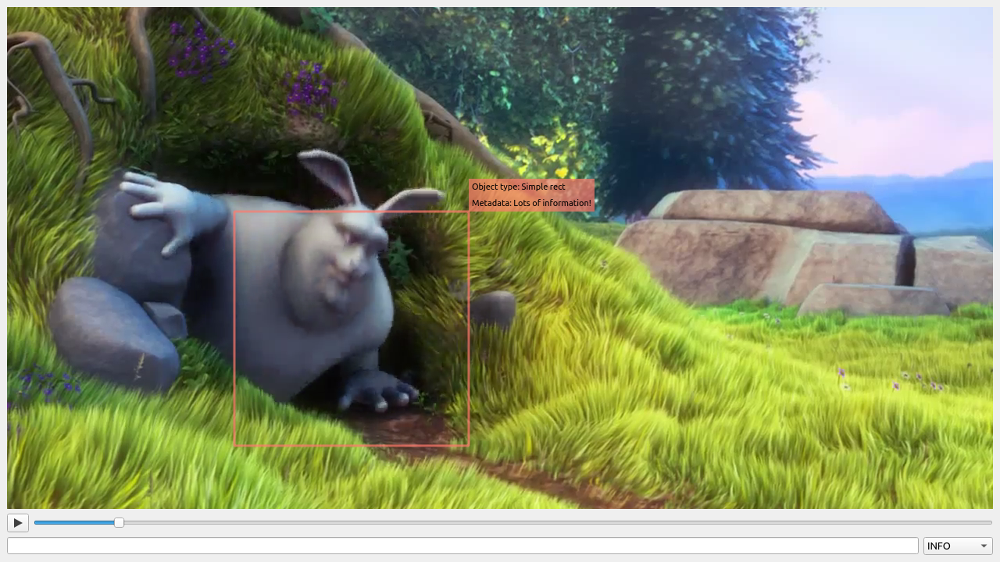

# naval 

Neat and Awesome Video Analytics Logging Library.

## Brief description

This library provides a logging-like interface to visualize debug information in OpenCV applications working with video streams, for example, video analytics.
In this case, one might what to visualize some debug information (like bounding boxes of detected objects) directly on the video frame.
This library provides a nice and easy way of achieving that.

## Example

```cpp
#include <filesystem>
#include <iostream>
#include <vector>

#include <naval/log_packet.hpp>
#include <naval/sink.hpp>
#include <naval/stream_logger.hpp>
#include <opencv2/videoio.hpp>

namespace fs = std::filesystem;

namespace my_namespace {

// This is user-defined rect that that we want to log
struct MyRect {
  MyRect(float x, float y, float width, float height) : x{x}, y{y}, width{width}, height{height} {
  }

  float x;
  float y;
  float width;
  float height;
};

}  // namespace my_namespace

namespace naval {

// User has to provide this function to convert from his types into naval primitives
template <>
inline std::vector<Vertex> ConvertToVertices(const my_namespace::MyRect& geometry) {
  const auto [x, y, width, height] = geometry;
  return {{x + width, y}, {x + width, y + height}, {x, y + height}, {x, y}};
}

}  // namespace naval

int main() {
  // Video is located alongside the source .cpp
  const fs::path video_path = fs::path{__FILE__}.remove_filename() / "bunny.mp4";
  // Log file location is small_bunny_1080p_60fps.mp4.navalil
  const fs::path log_path = fs::path{video_path}.replace_extension(".mp4.navalil");
  cv::VideoCapture video_capture{video_path.string()};

  naval::StreamLogger stream_logger{naval::CreateFileSink(log_path)};

  while (true) {
    cv::Mat frame;
    const double timestamp_sec = video_capture.get(cv::CAP_PROP_POS_MSEC) / 1000;
    std::cout << "Processing frame with ts_sec = " << timestamp_sec << "\n";
    if (!video_capture.read(frame)) {
      break;
    }

    my_namespace::MyRect rect{300, 300, 300, 300};
    naval::LogPacket log_packet{timestamp_sec};
    log_packet.Info(rect, {{"Object type", "Simple rect"}, {"Metadata", "Lots of information!"}});

    stream_logger.WritePacket(log_packet);
  }

  return 0;
}
```

After running the code above `bunny.mp4.navalil` will be created.
You can open it with `naval-player`.

Result:


## Requirements

- C++ 17 compiler
- CMake
- OpenCV>=4.5 (untested on older versions)

## Installation

- Simply use CMake `add_subdirectory`
- Alternatively, you can use `cpm-cmake`

## naval-player

`naval-player` is a simple PySide-based player for `.navalil` files. _Will be open-sourced later._

Installation: TODO.
