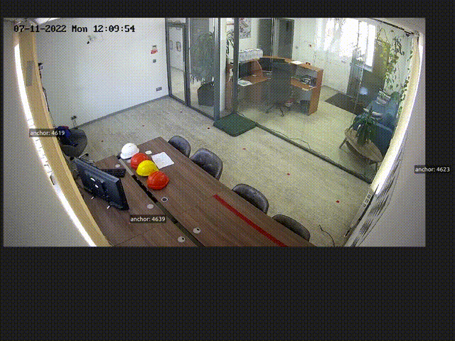

# naval 

Neat and Awesome Video Analytics Logging Library.

## Brief description



This library provides a logging-like interface to visualize debug information in OpenCV applications working with video streams, for example, video analytics.
In this case, one might what to visualize some debug information (like bounding boxes of detected objects) directly on the video frame.
This library provides a nice and easy way of achieving that.

## Features

- Logging arbitrary polygon-like primitives (rects, points, etc)
- Logging images (useful for visualizing preprocessed neural net inputs)
- Specifying log level (debug, info, etc) for each primitive for easy filtering
- Logging arbitrary metatada using tags (see demo above)

## Examples

### Basic usage

```cpp
#include <naval/log_packet.hpp>
#include <naval/sink.hpp>
#include <naval/stream_logger.hpp>
#include <opencv2/videoio.hpp>

int main() {
  cv::VideoCapture video_capture{"video.mp4"};
  naval::StreamLogger stream_logger{naval::CreateFileSink("video.mp4.navalil")};

  while (true) {
    cv::Mat frame;
    const double timestamp_sec = video_capture.get(cv::CAP_PROP_POS_MSEC) / 1000;
    if (!video_capture.read(frame)) {
      break;
    }

    naval::LogPacket log_packet{timestamp_sec};

    // Log stuff here

    stream_logger.WritePacket(log_packet);
  }

  return 0;
}
```

---

### Logging user-defined types

```cpp
namespace my_namespace {

// This is user-defined rect that that we want to log
struct MyRect {
  MyRect(float x, float y, float width, float height) : x{x}, y{y}, width{width}, height{height} {
  }

  float x;
  float y;
  float width;
  float height;
};

}  // namespace my_namespace

namespace naval {

// User has to provide this function to convert from his types into naval primitives
template <>
inline std::vector<Vertex> ConvertToVertices(const my_namespace::MyRect& geometry) {
  const auto [x, y, width, height] = geometry;
  return {{x + width, y}, {x + width, y + height}, {x, y + height}, {x, y}};
}

}  // namespace naval

void LogExample() {
  naval::LogPacket log_packet{0.0};

  my_namespace::MyRect rect{300, 300, 300, 300};
  log_packet.Info(rect, {{"Object type", "Simple rect"}, {"Metadata", "Lots of information!"}});
}
```

---

### Logging images
```cpp
#include <naval/log_packet.hpp>
#include <opencv2/core.hpp>

void LogImage(const cv::Mat& image) {
  LogPacket log_packet{0.0};

  log_packet.Info(image, {{"image_type", "nn_input_preprocessed"}});
}
```

---

## Requirements

- C++ 17 compiler
- CMake
- OpenCV>=4.5 (untested on older versions)

## Installation

- Simply use CMake `add_subdirectory`
- Alternatively, you can use `cpm-cmake`

## naval-player

`naval-player` is a simple PySide-based player for `.navalil` files. _Will be open-sourced later._

### Installation

1. [Download](https://disk.yandex.ru/d/vytI6d_4fjq3Tg) the .whl package.
2. On Ubuntu-based distros:
```bash
sudo apt-get install ubuntu-restricted-extras
```
3. Install the package:
```bash
pip install naval_player-0.4.5-py3-none-any.whl
```
